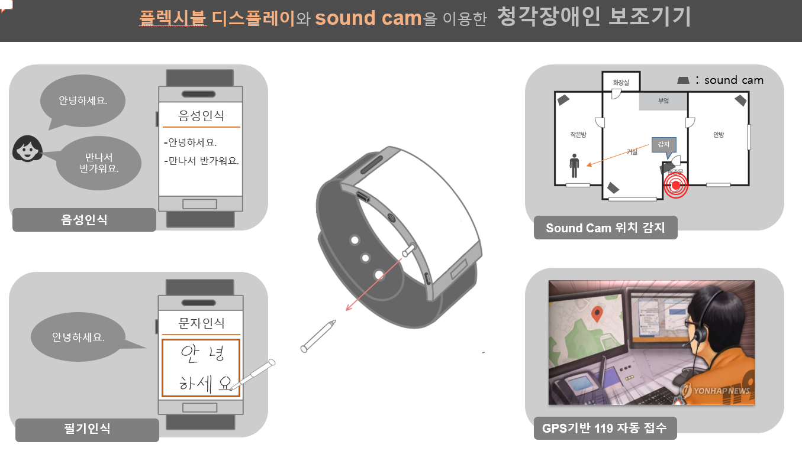

**본 폴더는 2019 디스플레이 챌린지와 관련된 폴더입니다.**

　
  　
  　
  　
  　
  
### 주제
- 'Sound Cam을 이용한 청각장애인용 웨어러블 기기'
　
　
 　
  　
### 아이디어 배경

 - 2017년 보건복지부에서 발표한 '2017 장애인 실태조사'에 따르면 260만명의 장애인 중 청각장애인의 비율은 11.9%
 
 - 그 중 심도 난청의 경우 말소리를 거의 듣지 못하며, 보청기로 도움 받는 것도 제한적
 
 - 일상이 위험이며 언제 어떤일이 일어날 지 모르는 불안 속에서 생활
        
        > 때문에 Sound Cam을 이용하여 소리를 시각화, 청각장애인에게 안전한 일상을 만들어 주고자 함.
        
        
### 요약

　
 　
  　
   　

### 제품 구성

 
 
　
 　
  　
   　

### 수상 내역

 
